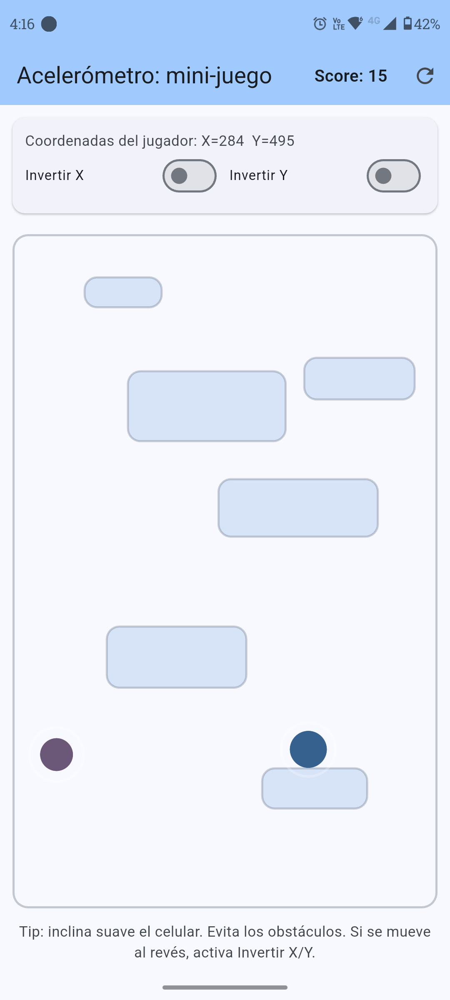
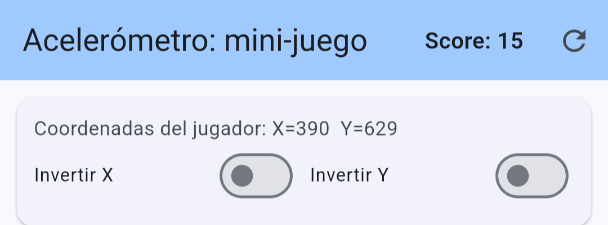
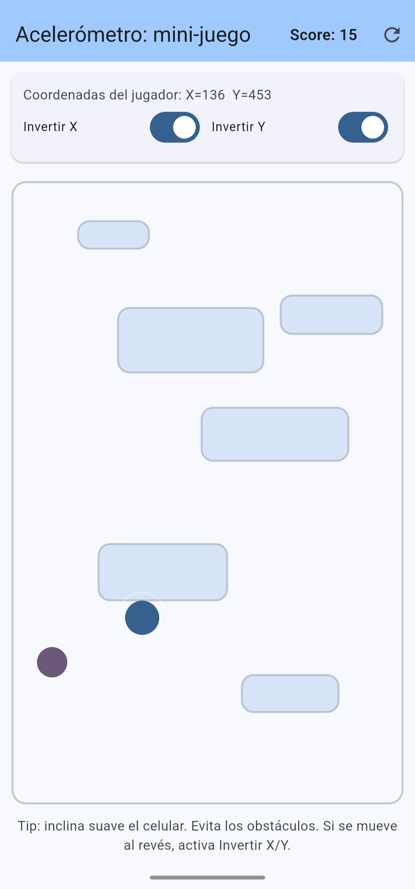

# acelerometro

Mini‑juego en Flutter controlado con el acelerómetro (`sensors_plus`).

## ¿Qué hace?

- Mueves al jugador (círculo azul) inclinando el celular.
- Debes alcanzar el objetivo (círculo verde) para sumar puntos.
- Cada vez que alcanzas el objetivo:
  - sube el **Score**
  - el objetivo cambia de lugar
  - se generan obstáculos nuevos (rectángulos)

## Controles

- **Invertir X / Invertir Y**: invierte el sentido del movimiento y se sentira “al revés”.
- **Coordenadas del jugador (X, Y)**: muestra la posición del jugador en pixeles dentro del área de juego.

## Capturas de pantalla 

1. vista general del juego (jugador, objetivo, obstáculos y el Score).
2. el panel mostrando **Coordenadas del jugador: X=… Y=…**.
3. switches de **Invertir X/Y** activados.
4. un Score > 0 después de alcanzar el objetivo.

Luego, cuando existan esos archivos, se verán aquí:

| Inicio | Coordenadas |
| --- | --- |
|  |  |

| Invertir X/Y | Score |
| --- | --- |
|  |  |

## Cómo ejecutar

```bash
flutter pub get
flutter run
```

## Estructura del código

- `lib/main.dart`: entrypoint de Flutter.
- `lib/screens/game_screen.dart`: pantalla del juego (UI + loop con `Ticker`).
- `lib/game/game_controller.dart`: estado + física (colisiones, score, suscripción al acelerómetro).
- `lib/game/game_painter.dart`: render del juego con `CustomPainter`.
